# Card Shark: Extraction Hustle

A goofy low-poly, first-person extraction game made in Godot 4. You're a shady card dealer: deploy to a local hangout, "trade" kids out of their best trading cards, fight off the angry parents with fists and swords, and **extract** before time runs out. Then sell your haul from the Shady Van and gear up for the next run.

Or skip the hustle and hold the **Rec Center** against endless waves of parents in **Wave Mode**, armed with cartoon toy blasters.

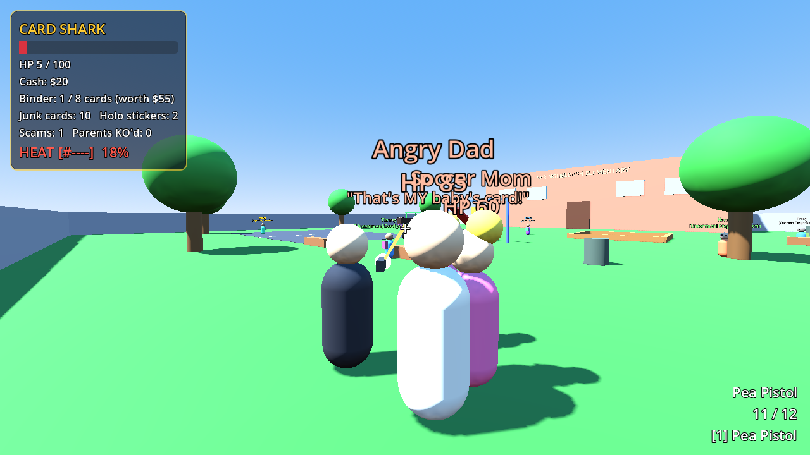

| Wave Mode: the Rec Center gym | Paintball vs. Angry Dads |
| --- | --- |
| 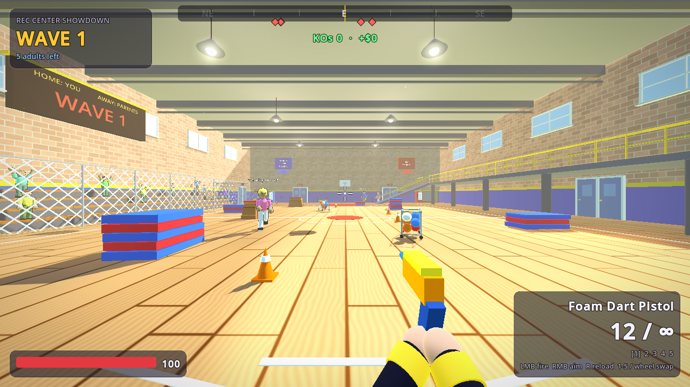 | 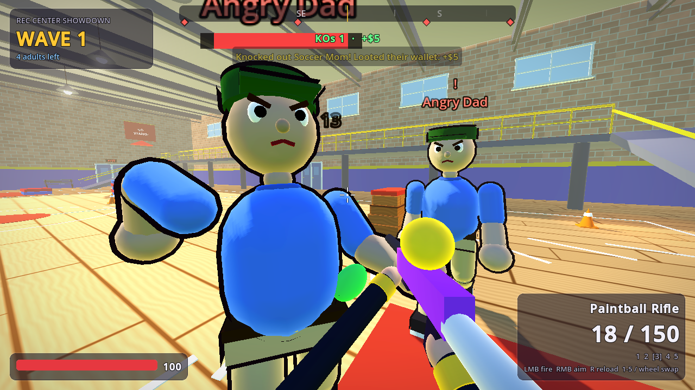 |
| **Principal Grimsby (boss)** | **Wave 2: the throwers arrive** |
| 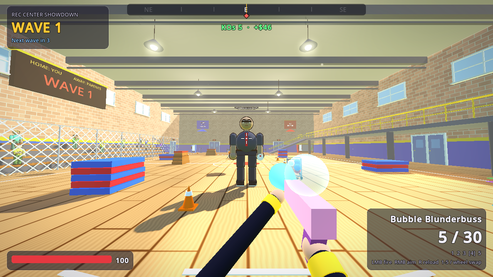 | 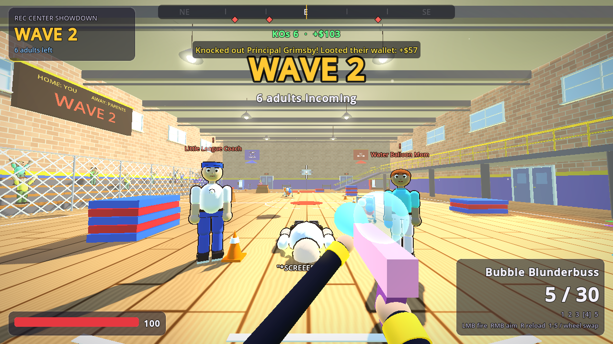 |

| Sunnyvale Playground | Friday Night Locals |
| --- | --- |
| 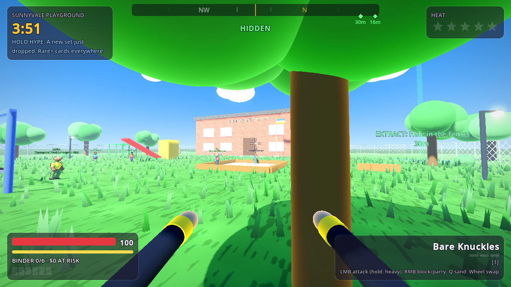 | 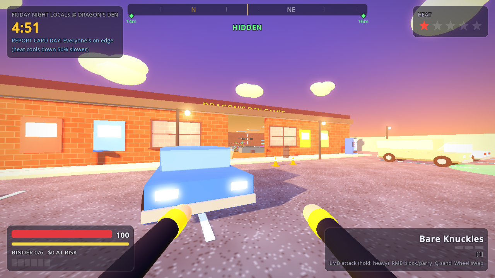 |
| **Pizza Party Palace** | **Seeing stars** |
| 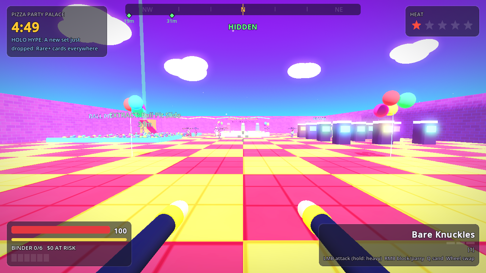 | 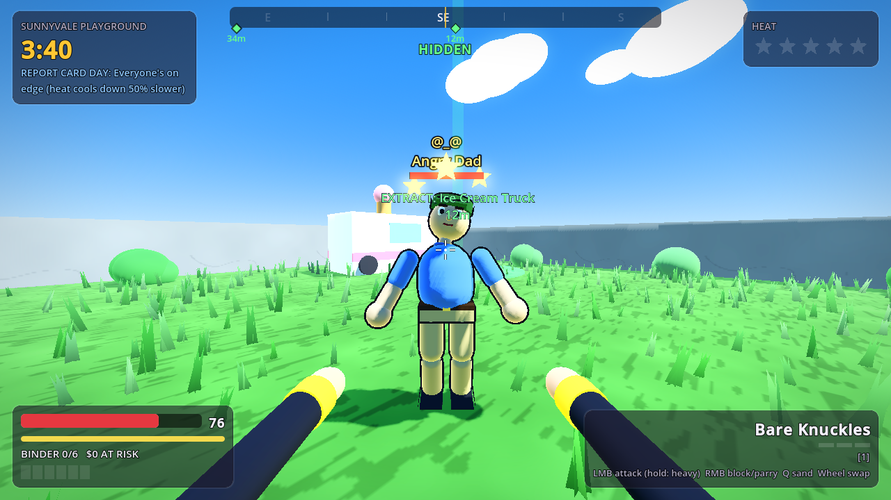 |

| The hideout | Trading |
| --- | --- |
| 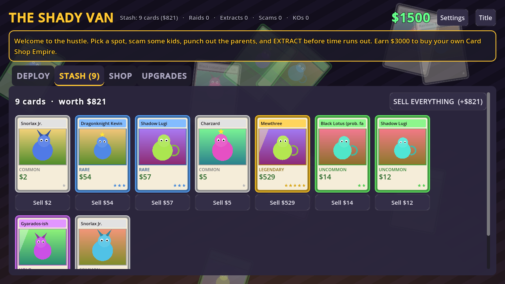 | 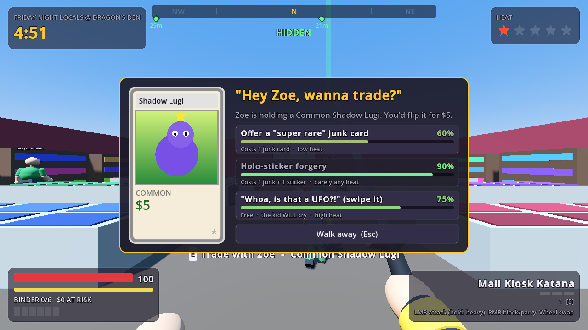 |

## Running

1. Install [Godot 4.3+](https://godotengine.org/download) (standard build, not .NET).
2. Open Godot → **Import** → pick this folder's `project.godot`.
3. Press **F5** (Play).

Everything (art, animation, sound) is generated in code, so there are no asset files to import. Progress saves automatically.

## Controls

| Input | Action |
| --- | --- |
| WASD | Move (run, about 5 m/s) |
| Shift | Sprint (about 6.8 m/s). Free, and it **carries through bunny hops** |
| Space | Jump. **Hold it to bunny hop**: you jump again the instant you land, with no ground friction. Hold Shift + Space to sprint-hop |
| Ctrl / C | Crouch-walk (quiet: parents hear you from less far away). **At speed you slide** with a small boost (once per second); jump out of a slide to keep the momentum |
| Mouse | Look (sensitivity, FOV and invert Y are in Settings) |
| Left click | Attack (click repeatedly for a 3-hit combo; the 3rd hit is a finisher) |
| Hold left click | Charge a heavy attack (uppercut / lunge), release when the ring fills. Costs stamina |
| Right click (hold) | Block: takes 75% less damage |
| Right click (just before a hit) | **Parry**: no damage, and the attacker is stunned |
| Q | Throw **Pocket Sand** with any weapon equipped (if you own it) |
| 1-7 / mouse wheel | Switch weapon |
| E | Trade with the kid you're looking at |
| Esc | Pause / close menu |

## Movement (STRAFTAT / Quake style)

Grounded, readable speeds: run about 5 m/s, sprint about 6.8 m/s, hard cap 12 m/s. All the numbers
live in `GameState.MOVEMENT`; see `specs/001-movement-retune/` for the spec and design.
Feature specs live in `specs/` (e.g. `specs/002-content-expansion-1/`).

- Ground movement has friction and acceleration, like Quake and Source.
- **Sprint + bunny hop:** hold Shift + Space to chain hops at sprint speed.
- **Air strafing:** in the air, hold A or D and turn the mouse the same way to gain a little speed
  each hop, up to the cap.
- **Sliding:** crouch while moving fast for a short slide with a small boost (at most once per
  second). Landing with crouch held turns straight into a slide, and jumping out of a slide keeps
  the speed.
- **Stealth:** crouch-walking is quiet, and sprinting is loud.
- Speed raises your FOV, and a speedometer appears under the crosshair. Hitting someone at speed
  adds bonus damage and knockback.
- Stamina is only used by **charged heavy attacks**. Movement is free.

## The loop

**Title → Hideout.** Continue a saved game or start a new one. The Shady Van has four tabs:

- **Deploy:** pick a location.
- **Stash:** see your extracted cards and sell them one at a time or all at once.
- **Shop:** buy supplies and weapons.
- **Upgrades:** permanent upgrades.

| Location | Entry | Guard | Notes |
| --- | --- | --- | --- |
| Sunnyvale Playground | free | Recess Monitor | Lots of kids, mostly junk cards. |
| Friday Night Locals @ Dragon's Den | $15 | Gary (Store Owner) | Tournament kids with holos. Starts at higher heat. |
| Pizza Party Palace | $25 | Cheesy the Rat | A birthday-party arcade. **Ball pit:** you're slowed to 2.5 m/s inside, but adults more than 2.5 m away can't see you, so it's great for losing a chase. Arcade cabinets give cover. |
| Galleria Mall Food Court | $40 | Mall Cop | Rich kids with Legendaries. Gym coaches show up fast. |

**Raid.** Look at a kid and press **E** to see their card and pick a tactic:

- *"Super rare" junk card*: costs 1 junk card. Decent odds, low heat.
- *Holo-sticker forgery*: costs 1 junk card + 1 sticker. Great odds, very low heat.
- *Bundle Deal*: costs 3 junk cards. Good odds, low heat.
- *Sob Story*: free, low odds, **no heat and the kid never cries**. If it fails, the kid just gets wary.
- *"Is that a UFO?!"*: free, but the kid always cries.

Rarer cards are harder to scam. Kids who **witness** a scam get wary (-20% odds), and if the patrolling **guard** sees you do it, they come after you.

**Raid events.** Every raid has a **WHALE**: a kid with a guaranteed Legendary card, a gold halo,
and a chaperone mom hovering nearby. Every raid also rolls one modifier, shown under the timer:

- *Bake Sale*: adults have 30% less sight range.
- *Report Card Day*: heat cools down 50% slower.
- *Free Refills*: kids show up twice as fast.
- *Holo Hype*: Rare+ cards are more common.

Patrolling guards and chaperones leave you alone until you stir things up (heat), or until they see
you scam someone.

## Wave Mode: Rec Center Showdown

Pick **Rec Center Showdown** on the hideout's DEPLOY tab (free). You defend the Sunnyvale Rec
Center gym against waves of adults pouring in through the doors. Clear a wave to get a cash bonus,
some health and an ammo restock, then the next, bigger wave arrives. Every 5th wave brings the boss,
**Principal Grimsby**: a slow heavy swing, a telegraphed megaphone blast ("DETENTION!!") and
hall-monitor backup. The run ends when you're knocked out or quit, and your best wave is saved.
Cash is banked as you earn it, so you never lose anything you owned.

| Input (Wave Mode) | Action |
| --- | --- |
| Left click | Fire (hold for the Paintball Rifle and the Soaker) |
| Right click | Aim: tighter spread, slight zoom |
| R | Reload |
| 1-5 / mouse wheel | Switch blaster |

Movement is the same as in raids, so bunny hopping and sliding work there too. Headshots **BONK**
for +50% damage. Knocked-out adults sometimes drop ammo boxes and juice boxes.

| Blaster | Price | Role |
| --- | --- | --- |
| Foam Dart Pistol | free | Precise, never runs out of reserve ammo. Darts stick in the walls |
| Super Soaker 3000 | $150 | Short-range stream; soaked adults slow down |
| Paintball Rifle | $300 | Full-auto; painted adults take +20% damage |
| Bubble Blunderbuss | $350 | Close-range burst with huge knockback |
| Rubber Chicken Launcher | $600 | Arcing splash shot. BWAK! |

The adults fight smarter here (and a bit in raids too):

- they spread out and **surround** you instead of forming a line;
- they **weave** when you aim at them and sometimes **sidestep** after being hit;
- they notice when they're **stuck** and walk around the obstacle.

New ranged adults show up from wave 2: the **Little League Coach** (fastballs) and the **Water
Balloon Mom** (lobbed balloons that splash). Both wind up visibly and aim where you're *going*, so
change direction to dodge. Kids only watch from the bleachers: nothing can hit them.

**Collector Orders.** The hideout's ORDERS tab has three orders (e.g. "Deliver 2 Holo+ cards:
$480"). Filling one uses the cheapest qualifying stash cards and pays at least 1.5× their sell
value. New orders roll after every raid.

**Extract.** Two of each level's three extraction points are open per raid. They show as green beams and as markers on the compass. Stand inside one for 5 seconds. Unblocked hits set the countdown back.

**What's at risk.** Your binder and the supplies you carry are lost if you're knocked out, run out of time, or abandon the raid. Cash, your stash and upgrades are always safe.

**Win** by buying your own Card Shop Empire for $3000.

## Graphics

Everything is still generated in code, with no imported assets:

- **Cartoon rendering.** Everything uses cel-shaded (banded) lighting with a soft rim light, and characters get ink outlines.
- **Lighting moods** per location: noon at the Playground, golden hour at the Locals, a purple party glow at Pizza Palace and cool daylight at the Mall. Each has its own sun, sky, fog and color grading.
- **Procedural textures** are generated at startup: grass, asphalt, floor tiles, wood, brick, carpet and concrete.
- **Faces with expressions.** Characters have eyes with pupils, noses, mouths and cheeks. Adults scowl when they spot you, and scammed kids look sad and cry real tears. Kids get varied hairstyles (bowl, spiky, bun, ponytail) or caps.
- **Living levels.** Wind-swaying grass, round trees and bushes, drifting clouds, lamp posts, posters, balloons and streamers.
- **Effects.** Hit sparks, dizzy stars over stunned and KO'd adults, gold sparkles around the whale, dust motes indoors, and pulsing extract beams.
- **Realistic first-person hands**: each hand is one continuous, anatomically shaped skin mesh generated in code (a signed distance field of bones, knuckles, tendons, veins, palm pads and finger webbing, meshed with surface nets) and skinned to a 16-bone skeleton, so fingers bend like real skin. Skin tone is painted per vertex (redder knuckles, lighter palms, pink fingertips, flexion creases, faint veins), with glossy curved nails, a folded cloth sleeve and a digital watch. Fingers grip each weapon for real: fists clench on every punch, hands wrap the sword handle and blaster grips, the trigger finger squeezes on every shot, and the hand opens on a pocket-sand throw. The mesh is built on a background thread at launch and cached in `user://`.

  | Open hand | Pistol grip |
  | --- | --- |
  | 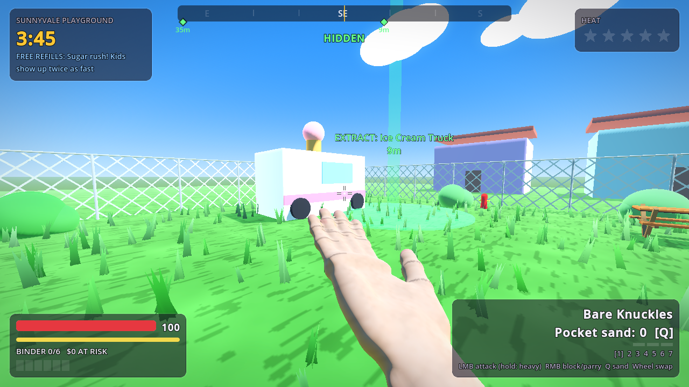 | 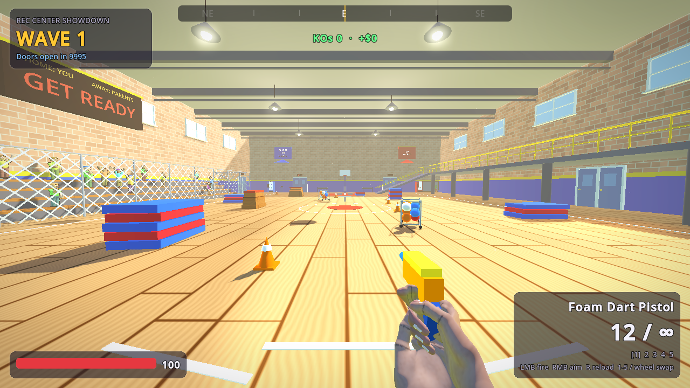 |
- **Detailed levels** built from a prop kit of 26 kinds: chain-link fences, a school with a roof, windows, doors and a flagpole, picnic tables, cars and a minivan, a school bus, a bus shelter, vending machines, arcade cabinets, storefronts with glass and awnings, a mall skylight, ceiling lights, gym mats, bleachers and more.
- **Graphics quality** (Settings): **High** or **Low (faster)**. Low turns off outlines, shadows, ambient occlusion, floor reflections and light shafts, cuts grass to 20% and particles to 40%, and keeps fewer paint splats. It applies from the next raid and is saved.

## The AI

- Parents and guards have a **vision cone with line of sight** and can **hear** you sprinting and fighting. Hoodie upgrades shrink how far they can see you.
- They move between **patrol → investigate → chase → engage → search** states, and they path around obstacles on a baked navmesh. The compass status shows HIDDEN, SEARCHING or SPOTTED.
- Only 2-3 parents attack at once. The rest **circle** you, waiting their turn, and back off after swinging.
- They **wind up** before every swing, so you can block, parry or back off. Getting hit interrupts them, and heavies and parries stagger them.
- Crying kids run to the nearest grown-up, and nearby adults come to check on them. Once heat is up, parents radio each other ("the mom group chat").
- Kids hang out at tables and play spots, chat with each other, cheer when a fight breaks out nearby, and flee if it gets too close.
- Soccer Moms sometimes flee at low health ("I'm calling my LAWYER!").
- **Nana** shows up at 3+ heat stars. She's slow and tanky, and her cane swing has a long, clearly
  telegraphed wind-up and the longest reach of any adult.

## Weapons

| Weapon | Type | Notes |
| --- | --- | --- |
| Bare Knuckles | fist | Fast jabs and hooks |
| Brass Knuckles | fist | Hits hard |
| Foam LARP Sword | sword | Cheap, long reach, wide slashes |
| Boxing Gloves | fist | Huge knockback and stun |
| Mall Kiosk Katana | sword | Big damage, slashing combo, lunge heavy |
| Power Gauntlet (1989) | fist | Hits everything in a wide arc |
| Pocket Sand | thrown | "POCKET SAND!" Blinds every parent in a cone for 3.5s. They rub their eyes, stumble and lose track of you. Uses sand packets (3 for $8), which you lose if you don't extract |

**Upgrades:** Silver Tongue, Light-Up Sneakers, Fat Binder, Puffy Vest, Protein Shake, Gym Membership (stamina for heavies), Shady Hoodie (heat + stealth), Fake Grading Slabs.

## Spec-driven development (Spec Kit)

This repo has [GitHub Spec Kit](https://github.com/github/spec-kit) installed for Claude Code. Start a Claude Code session in this folder and use:

1. `/speckit-constitution` to set the project's principles (written to `.specify/memory/constitution.md`).
2. `/speckit-specify <feature description>` to write a spec for a new feature.
3. `/speckit-plan` to turn the spec into a technical plan.
4. `/speckit-tasks` to break the plan into tasks.
5. `/speckit-implement` to build it.

There are also some optional skills: `/speckit-clarify`, `/speckit-analyze`, `/speckit-checklist`, `/speckit-converge` and `/speckit-taskstoissues`. Templates and helper scripts live in `.specify/`, and the skills live in `.claude/skills/`.

## Project layout

- `scripts/game_state.gd`: autoload with meta progress, raid state, all tuning tables, save/load, settings and the input map.
- `scripts/sfx.gd`: autoload with procedurally synthesized sound effects.
- `scripts/main.gd`: hideout and raid lifecycle, spawning, scams and witnesses, AI coordination (attack tokens, radio), extraction.
- `scripts/levels.gd`: level geometry plus a navmesh baked at runtime; spawn, extract, patrol and hangout points.
- `scripts/art.gd`: the art toolkit: quality profiles, toon materials, outlines, procedural textures, lighting moods, grass/trees/clouds and particle effects.
- `scripts/props.gd`: the prop kit used by every level. `scripts/arena.gd`: the Rec Center gym (Wave Mode).
- `scripts/waves.gd`: the Wave Mode director. `scripts/gunplay.gd`: blasters (ammo, firing, reload, aim). `scripts/rocket.gd`: the rubber chicken. `scripts/thrown.gd`: fastballs and water balloons. `scripts/pickup.gd`: ammo and juice boxes. `scripts/spectator.gd`: kids in the bleachers.
- `scripts/rig.gd`: jointed humanoid with procedural walk/run cycles and blended action poses.
- `scripts/player.gd`: first-person controller with Quake-style movement (air strafe, bhop, slide), combos, heavies, block/parry, pocket sand and camera feel.
- `scripts/viewmodel.gd`: first-person arms, weapons and blasters, attack animations, sway and sword trails. `scripts/hand.gd`: the realistic hands (skeleton, nails, sleeve, finger poses). `scripts/hand_mesh.gd`: the SDF hand mesh generator.
- `scripts/parent.gd`, `scripts/kid.gd`: AI state machines.
- `scripts/hud.gd`: in-raid UI. `scripts/hub.gd`: title screen and hideout.
- `scripts/ui/`: shared theme and widgets (compass, crosshair, trading card renderer, settings).
- `tests/smoke_test.gd`: headless smoke test. Run it with `godot --headless --path . res://tests/smoke.tscn` (exits 0 on pass).
