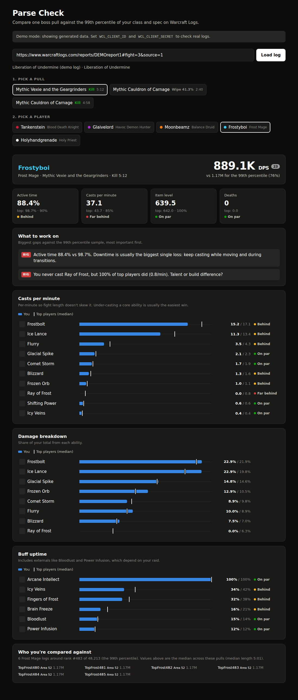

# Parse Check: WoW Logs Checker

Paste a [Warcraft Logs](https://www.warcraftlogs.com) report, pick a boss pull and a player, and see how that pull compares with **99th-percentile players of the same class and spec** on the same boss and difficulty.



## What it compares

| Stat | How |
| --- | --- |
| DPS / HPS | Healers are compared on HPS, everyone else on DPS. Your WCL parse is shown too. |
| Active time | Percent of the fight you were casting or attacking. |
| Casts per minute | Overall and per ability, so fight length doesn't skew it. Flags abilities you under-cast or never pressed. |
| Damage / healing breakdown | Each ability's share of your total. |
| Buff uptime | Your cooldowns and procs, plus externals like Bloodlust. |
| Item level, deaths | Shows how much of the gap comes from gear and dying. |

A **What to work on** list ranks the biggest gaps first.

### How the 99th-percentile benchmark is built

1. Get the character leaderboard for your encounter, difficulty, class, spec and metric (`worldData.encounter.characterRankings`).
2. Use the total number of ranked characters to find the entry at the 99th percentile. With 48,000 ranked, that's rank ~483.
3. Take a sample of logs centered on that rank (6 by default), fetch each one's tables and take the **median** of every stat. An ability only counts toward the benchmark if at least half the sample used it.

Benchmarks are cached in memory for 6 hours per boss, spec and difficulty, so only the first lookup is slow. If the API doesn't return a total count, it falls back to the top of the leaderboard and the page says so.

## Running

You need Node 18+. There are no dependencies to install.

### Demo (no API key)

```sh
npm run demo
```

Open http://localhost:3000. The page loads generated data, so you can try the UI right away.

### With real logs

1. Create an API client at https://www.warcraftlogs.com/api/clients/. Any name works, and the redirect URL can be `http://localhost`.
2. Run:

```sh
WCL_CLIENT_ID=your-id WCL_CLIENT_SECRET=your-secret npm start
```

3. Paste a report URL. A link with `#fight=…&source=…` selects that pull and player for you.

| Env var | Default | |
| --- | --- | --- |
| `WCL_CLIENT_ID`, `WCL_CLIENT_SECRET` | none | Without them the app runs in demo mode. |
| `WCL_HOST` | `www.warcraftlogs.com` | Use e.g. `classic.warcraftlogs.com` for Classic. |
| `PERCENTILE` | `99` | Benchmark percentile. |
| `SAMPLE_SIZE` | `6` | Logs per benchmark. More is steadier but uses more API points. |
| `PORT` | `3000` | |

Your client secret stays on the server. The browser only talks to this app.

## Tests

```sh
npm test
```

## Layout

- `server.js`: HTTP server with the JSON API (`/api/report`, `/api/analyze`) and static files.
- `lib/wcl.js`: OAuth client-credentials and GraphQL client.
- `lib/source.js`: Warcraft Logs queries, including batched benchmark fetches.
- `lib/analyze.js`: pure stat extraction, benchmark aggregation and comparison.
- `lib/checker.js`: puts the pieces together and caches results.
- `lib/demo.js`: offline fake data in the API's shapes.
- `public/`: the web UI (plain HTML, CSS and JS).

## Caveats

- Benchmark players may have run different talents. A "never cast" flag can mean a build difference rather than a mistake.
- Uptime for external buffs depends on your raid, not just you.
- The queries were written against the documented v2 schema and tested with fixtures. They haven't been run against the live API yet, so if a field has been renamed, `lib/source.js` is the place to fix it.
